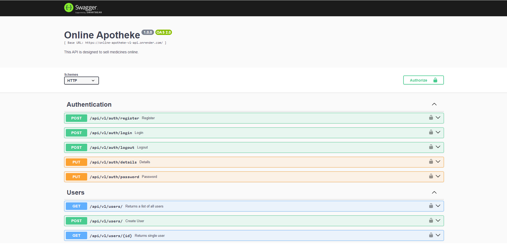

# Online-Apotheke Backend

## Projektbeschreibung
Online-Apotheke ist einer vollständig responsiven Website, die es Benutzern ermöglicht, Medikamente basierend auf ihren individuellen Bedürfnissen zu finden. Benutzer können entweder über eine Suchleiste oder durch die Navigation auf der Website nach Medikamenten suchen. Nach der Auswahl können sie die Medikamente direkt in ihren Warenkorb legen und sicher über ein integriertes Bezahlsystem bezahlen.

## Backend Technologie-Stack
- **Node.js:** Eine JavaScript-Laufzeitumgebung für die Entwicklung von serverseitigen Anwendungen.
- **Express.js:** Ein minimalistisches und flexibles Node.js-Webanwendungs-Framework, das bei der Erstellung von Webanwendungen und APIs hilft.
- **MongoDB:** Eine dokumentenorientierte NoSQL-Datenbank, die für ihre Flexibilität und Skalierbarkeit bekannt ist.
- **Mongoose:** Eine Node.js-Bibliothek, die die Arbeit mit MongoDB erleichtert und das Datenmodellierung für die Anwendung unterstützt.
- **Express-Async-Errors:** Ein Middleware-Paket, das das Handling von asynchronen Fehlern in Express-Anwendungen vereinfacht.
- **JWT (JSON Web Tokens):** Ein Standard für sichere Übertragung von Daten zwischen Client und Server als JSON-Objekt.
- **Stripe Payment:** Ein Zahlungsabwicklungssystem, das Online-Zahlungen ermöglicht und sichere Transaktionen gewährleistet.

## API-Dokumentation
Die API-Dokumentation kann über die Swagger UI aufgerufen werden. Starte den Server und besuche `http://localhost:3000/api-docs` in deinem Browser, um die API-Dokumentation anzuzeigen.

## ERD

## Overview

## URL
https://online-apotheke-v1-api.onrender.com